# Employee-o-matic
Student toy dedicated employed management database management system
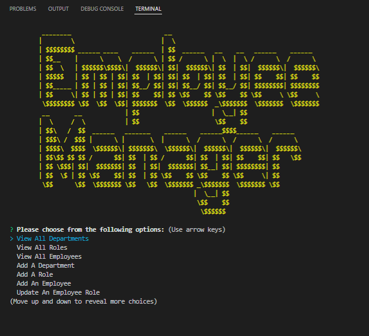

####GitHub Repository(https://github.com/mjtanner-github/Employee-o-matic).

## Introduction

Employee-o-matic is a student toy dedicated employee management database management system (DBMS) intended to exercise command line interface and fundamental database interaction (record creation, retrieval, alteration and deletion) as well as rootamentary logical operations with "join".

## Installation

Before using the Employee Management Database Management System (DBMS), some assembly is required.  
1. Connect to the MySQL server.

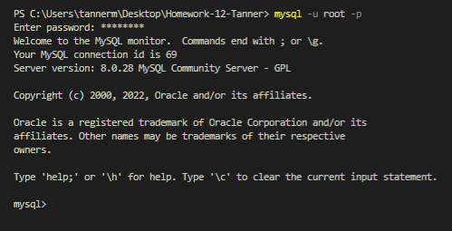

2. Build the database sourcing schema.sql file.

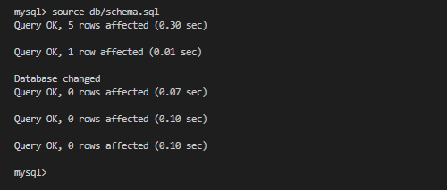

3. Populate the database with mock data by sourcing the seeds.sql file.

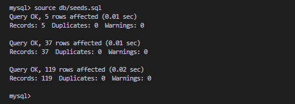

4. Close the mysql connection.

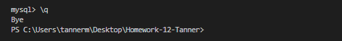

5. Install the program dependancies.

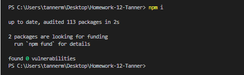

6. Finally run the program with 'node'. 

## Operation

The main menu is presented showing all the assignment requirements.

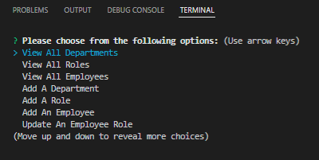

#### Select "Display All Departments".

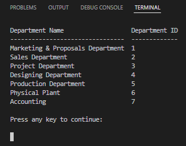

All departments are displayed.

####  Press any key. Then main menu reappears.

####  Select "Display All Roles".

All roles are displayed. 

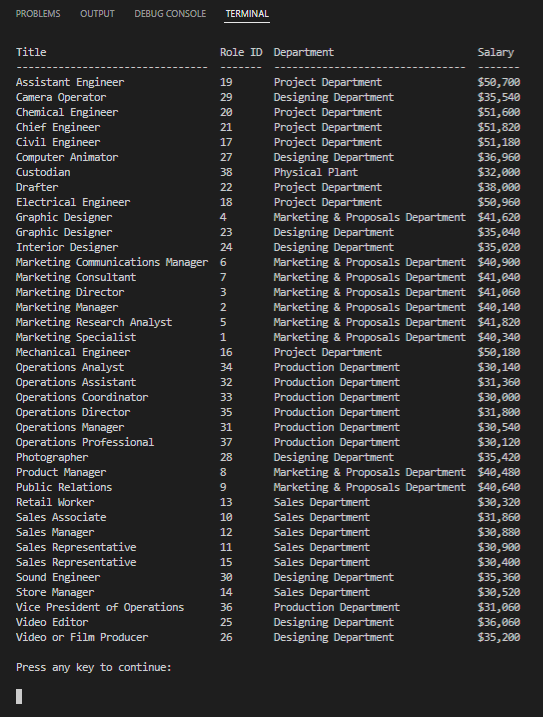

Again press any key and the main menu again reappears.

####  Select "Display All Employees".

All employees are displayed.

Again press any key and the main menu again reappears.

####  Select "Add A Department".

You are prompted to enter the name for the new department and the new department is added to the database.  

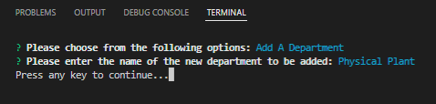

Again press any key and the main menu again reappears.

####  Select "Add A New Role".

You are prompted to enter a name and salary for the new role and select the department for which the role is to be associated. The new role is added to the database.

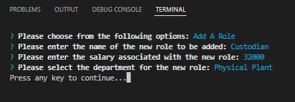

Again press any key and the main menu again reappears.

#### Select "Add A New Employee". 

You are prompted to enter the new employee's first and last name, select the new employee's role and manager. The new employee is added to the database. 

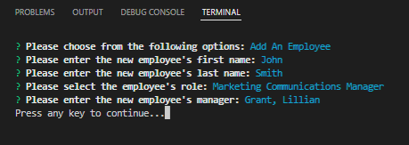

#### Select "Update An Employee's Role".

You are promted to select the employee's name, select the employee's new role and manager. The employee's role is updated in the database.

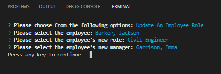

#### Select "Exit The System".

The database connection and application are closed.

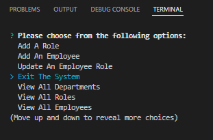
